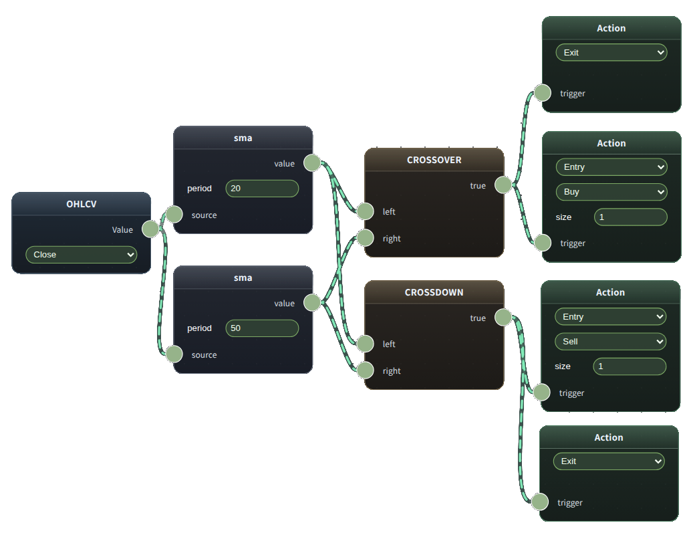

---



ノードベースで売買戦略を組み立てる、TypeScript モノレポ構成の戦略ビルダーです。

## Tech Stack

- `Bun` (package manager / runtime)
- `Turbo` (monorepo task orchestration)
- `React + Vite` (client)
- `Rete.js` (node editor)
- `Hono` (server API)
- `shared` workspace (型・共通ロジック)

## Project Structure

```text
.
├── client/   # LP + strategy builder UI (React / Vite / Rete)
├── server/   # API (Hono)
├── shared/   # shared types / schemas / utilities
├── package.json
└── turbo.json
```

## Features (Current)

- ノードベース戦略エディタ
  - OHLCV / Indicator / Math / Logical / Boolean Logic / Action ノード
- 戦略グラフのシリアライズ・復元
- URL パラメータ経由の戦略共有
- LP（ランディングページ）
- バックテスト API エンドポイント（`/api/backtest`）

## Getting Started

### Requirements

- `bun` (推奨)

### Install

```bash
bun install
```

## Development

### Run all workspaces

```bash
bun run dev
```

### Run individually

```bash
bun run dev:client   # Vite client
bun run dev:server   # Hono server (Turbo 経由)
bun run dev:server:cf # server workspace を直接起動 (root wrangler.jsonc を利用)
```

## Build

```bash
bun run build
```

個別ビルド:

```bash
bun run build:client
bun run build:server
```

## Quality Checks

```bash
bun run lint
bun run type-check
bun run test
```

## Environment Variables

現在確認できる主なクライアント環境変数:

- `VITE_SERVER_URL` - API ベース URL（`client/src/services/apiClient.ts`）

例:

```env
VITE_SERVER_URL=http://localhost:3000
```

## API

Server は Hono で `/api` 配下にルーティングされています。

- `GET/POST ... /api/backtest`（実装は `server/src/routes/backtest`）

## Shared Types

`shared` workspace の型・スキーマを client / server で共通利用しています。

例:

```ts
import { NodeSpec, Graph } from "shared";
```

## Notes

- `postinstall` 時に `shared` と `server` のビルドが走ります
- LP の SEO メタタグは `client/index.html` に設定しています（`canonical` / `og:url` は本番ドメインに合わせて更新）
